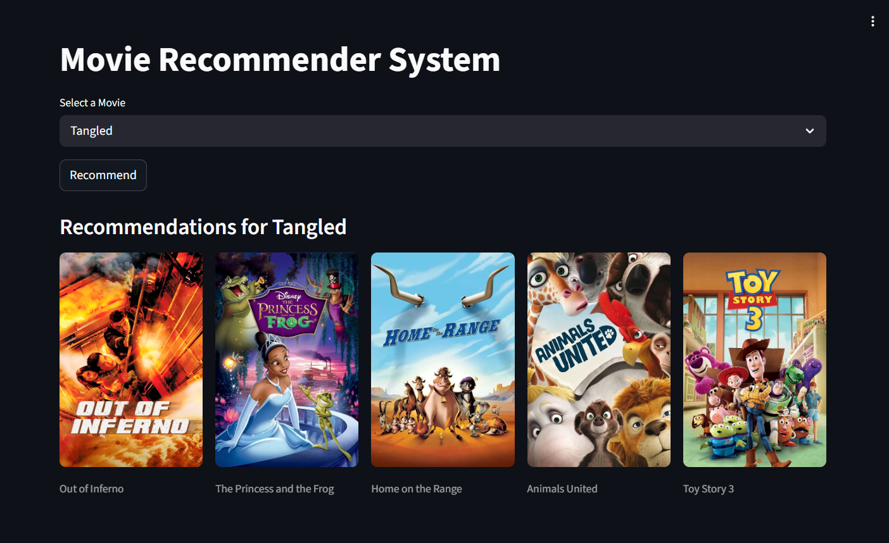

🎬 Movie Recommender System

A production-ready full-stack ML system that delivers real-time movie recommendations using a scalable API and interactive UI.

🌐 Live Application

🔗 Live Demo: (https://tmdb-movie-recommender-system-biza.onrender.com)

⚙️ API Endpoint: (https://movie-recommender-system-backend-0pdh.onrender.com)

📄 API Docs: (https://movie-recommender-system-backend-0pdh.onrender.com/docs)

🎥 Demo Preview

🧠 Problem & Solution

Finding relevant movies from large catalogs is time-consuming.
This system solves it by building a content-based recommendation engine that suggests similar movies instantly.

🏗️ Architecture

User → Streamlit Frontend → FastAPI Backend → ML Model → TMDB API

* Frontend handles user interaction
* Backend serves ML predictions via API
* Model computes similarity using preprocessed data
* External API fetches movie posters

⚙️ Tech Stack

* Backend: FastAPI, Uvicorn
* Frontend: Streamlit
* ML: Scikit-learn, Pandas, NumPy
* Deployment: Render
* Data API: The Movie Database

📊 How It Works

* User selects a movie from dropdown
* Request is sent to backend API
* Backend computes similarity scores
* Top recommendations are returned
* Posters are fetched dynamically
* Results displayed in UI

🚀 Deployment

* Backend deployed on Render
* Frontend deployed on Render
* Scalable architecture using REST APIs

👨‍💻 Author

Sanjara

Aspiring ML Engineer